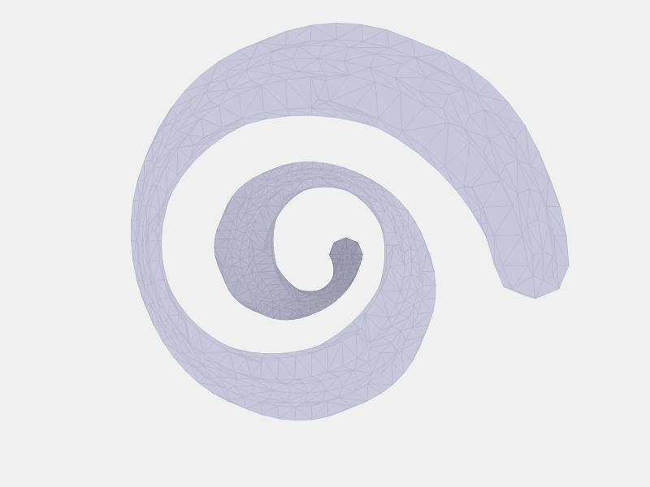
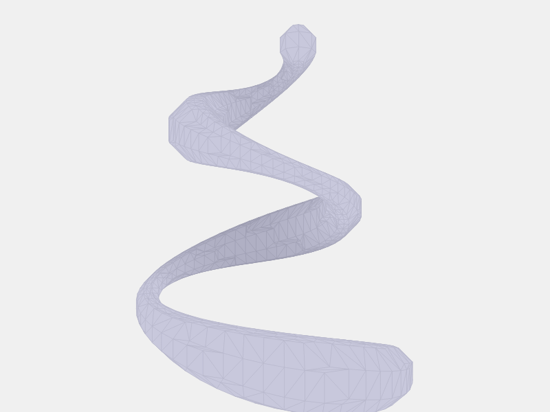

# 33-swept-path.scad - Rendered Output

Generated on: 2025-06-20T22:48:57.115Z

## 3D Model

- **Source**: 33-swept-path.scad
- **STL**: [33-swept-path.stl](./33-swept-path.stl)

## Rendered Views

### Front View

### Back View

### Left View

### Right View

### Top View

### Bottom View

### Isometric View

### Isometric-alt View

---
*Generated by [scad-to-png](https://github.com/imjasonh/scad-to-png)*
